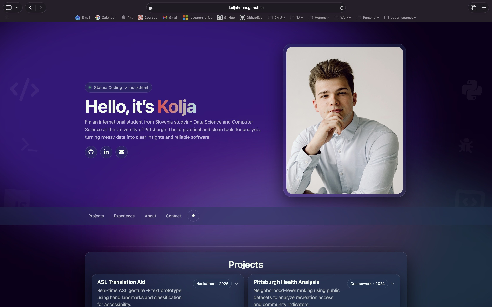
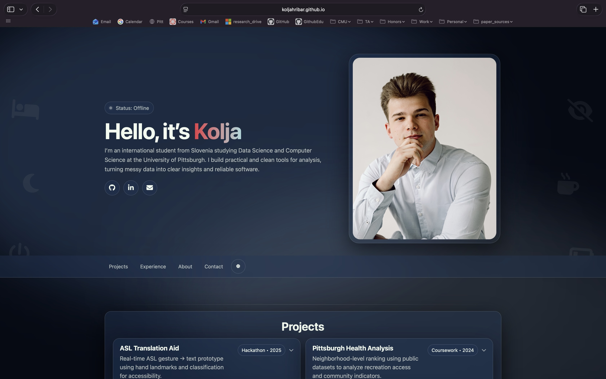
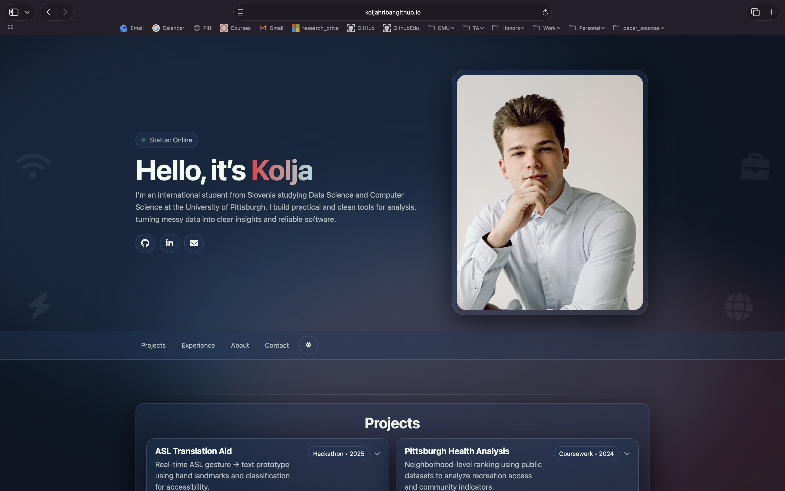

### API Implementation Details
This project uses JavaScript's `fetch()` module to query the Lanyard REST API endpoint. The primary parameter provided is my public Discord User ID (`8006...`), which returns a JSON object containing nested string and boolean data about my current online status and activities. No private API keys or authentication tokens are required for this implementation because it relies entirely on public Discord presence data. It's a little risky, but worth the extra features it adds to my portfolio website.

### Key Prompts
AI Tool Used: Google Gemini (Pro 1.5)
Date: February 4, 2026

1. Initial Setup:
   "could you give me all the code needed to set this up now. i want my status to be visible in that space above my name where it says: Student • Data Science • Pittsburgh. inseat of this put my status there. this is my discord id: 8006..."

2. Editing the output:
   "it now shows this: Status: Coding: In portfolio_website - 0 problems found. I want it to say 'Status: Coding in portfolio_website' or would it be better to say in what language, or what file i am currently working on. think critically, decide and tell me what changes ot make"

3. Adding advanced features:
   "I like the idea that the background changes based on what I do at that moment. Have three modes. ONe for just online, one for the coding and one for the offline. make sure they change in light mode too. Keep the same waves structure though. You can add items on the left and right."

## Screenshots

Here is how it looks like in real time:

### 1. Coding Mode

*It displays what and when I am coding*

### 2. Offline Mode

*Switches to a chill background when I'm offline*

### 3. Online Mode

*Switches to a more lively background when I'm online*